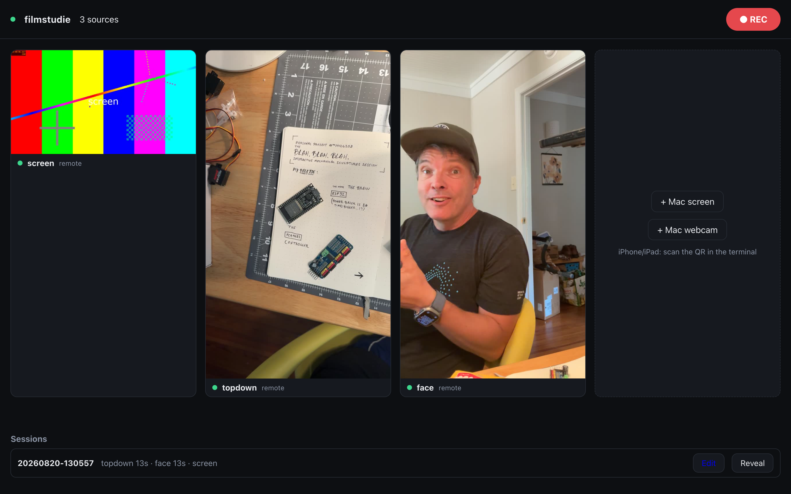
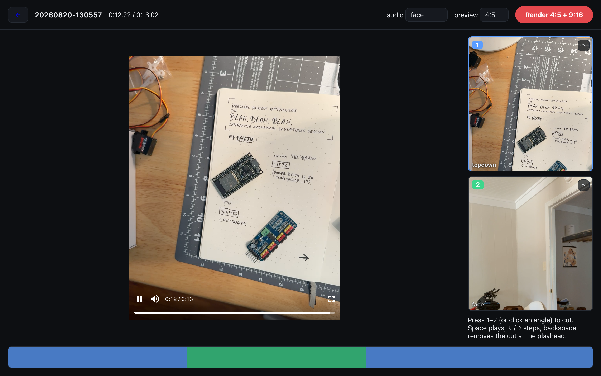
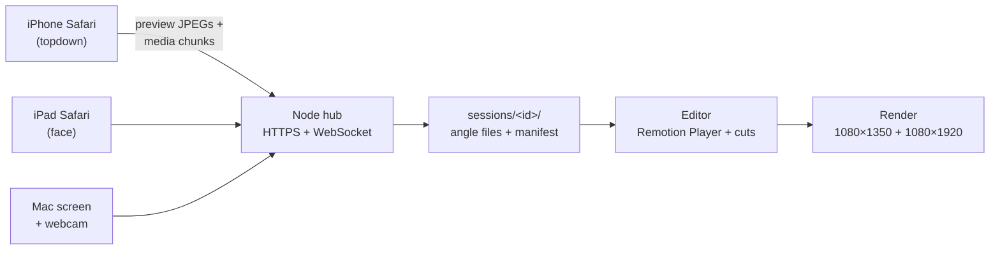

# filmstudie

A little mobile film studio: multicam recording and hotkey editing for 4:5 and 9:16 social
video — one Mac plus the iPhone and iPad you already own. No capture cards, no companion
apps, no editing suite.



**Produce** — the Mac shows a live grid of every angle with one big REC button. iPhone and
iPad join by scanning a QR code in Safari; the Mac contributes its own screen and webcam as
extra angles. While recording, every camera streams its footage to the Mac in real time, so
when you hit stop the files are already there — remuxed, clock-synced, and organized into a
session folder.



**Edit** — synced multicam playback with the program monitor on the left and every angle on
the right. Press `1`/`2`/`3` while it plays to cut cameras like a vision mixer. Pick which
camera's audio runs continuously, rotate any angle in 90° steps (gorillapods happen), and hit
Render.

**Publish** — one click renders both `out-4x5.mp4` (1080×1350 for Instagram and LinkedIn)
and `out-9x16.mp4` (1080×1920 for YouTube Shorts and Reels) from the same edit, via
[Remotion](https://remotion.dev).

## How it works



- **Capture** — each camera page records at full quality with MediaRecorder and streams
  ordered chunks over its WebSocket *during* recording: no upload wait, no device memory
  pressure, and a WiFi hiccup buffers locally and resumes (chunks are acked by byte count).
  On stop the server remuxes each stream (`ffmpeg -c copy`) into a clean seekable file —
  fMP4 from Safari, WebM/h264 from Chrome, normalized per codec.
- **Sync** — record commands are timestamped and every device reports its recorder start
  against a ping-estimated clock offset. That lands angles within a frame or two of each
  other, which is plenty for hard cuts.
- **Edit** — the edit is just data: a list of `{atFrame, sourceId}` cuts plus an audio
  choice and per-angle rotations in `session.json`. The same Remotion composition drives the
  editor preview and the server-side render, so what you see is exactly what renders.

## Requirements

- macOS with [Homebrew](https://brew.sh), Node ≥ 20, ffmpeg (`brew install ffmpeg`)
- iPhone/iPad on the same WiFi network

## First-time setup

```sh
npm install
npm run setup     # installs mkcert, creates the studio's TLS certificate
```

Then once per iPhone/iPad (iOS requires a trusted certificate before Safari will open the
camera on a local server):

1. Open `http://<your-mac>.local:4434/` on the device (the URL is printed at startup).
2. Download the root certificate → Settings → **Profile Downloaded** → Install.
3. Settings → General → About → **Certificate Trust Settings** → enable full trust for **mkcert**.

## Daily use

```sh
npm start
```

- The terminal prints the producer URL and a QR code for the camera URL.
- Open the producer on the Mac; add **Mac screen** / **Mac webcam** sources there.
- Scan the QR with iPhone/iPad, name the angle once (`topdown`, `face`), hit **Start camera**.
- **REC** records every connected source; **Stop** finalizes everything into
  `sessions/<timestamp>/`.
- **Edit** on a session row opens the editor; **Render 4:5 + 9:16** drops both finished
  videos into the session folder.

While recording, keep Safari in the foreground and the screen on — iOS stops the camera
otherwise. The camera page holds a wake lock and shows a loud warning if a feed is
interrupted.

## Development

```sh
npm test          # end-to-end ingest test (fake camera streams fMP4 chunks, verifies output)
npm run server    # server only (expects studio/dist to exist)
npm run build     # rebuild the studio app
node scripts/fake-camera.mjs --name topdown [--video clip.mp4]   # fake feed for UI work
```

Three workspaces: `server/` (Express + ws hub, chunked ingest, Remotion render runner),
`studio/` (Vite + React app: `/producer`, `/camera`, `/edit`), and `video/` (the Remotion
composition shared by the editor preview and the renderer).

## Roadmap

- Audio cross-correlation auto-sync + import of offline cameras (e.g. DJI Osmo Nano via
  Vision Dock offload)
- Picture-in-picture and split layouts
- WebRTC live previews; QR code in the producer page
